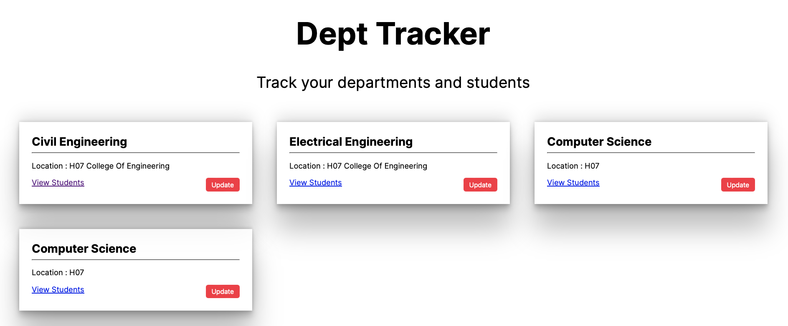

# CMPS 350 Web Development Fundamentals - Spring 2024

# Final Practical Exam - Section B51 - Department Student Tracker

## Instructions

* The exam duration is **120 minutes**.
* **Push your code to GitHub** regularly to avoid any data loss.
* The exam is **open book**. Plagiarism will result in a score of zero for all parties involved.
* Demo your work before leaving the exam.
* Add screenshots of the output to the testing sheet.
* Push your code and testing sheet to your GitHub repo under the Final Exam section.

## Preparation

* Sync CMPS350 Lab repo to get the Final Exam Files.
* Download the **Final Exam Folder** from GitHub and move it to your repository.
* Open the **Department Student Tracker-base code** project and Run **npm install** to get all dependencies.
* Create the .env file [rename the given one].
* Make sure you have the **Prisma** extension in your VS Code for Prisma code highlighting.
* Runs the project with **`npm run dev`**.

## Department Student Tracker App

In this Exam, you will demonstrate your ability in front-end and back-end web development by creating a web application for managing departments and student registrations. The application will be built using Next.js, React, and Prisma. It will allow users to manage departments and student details.

## Creating the Database Models and Repository (35%)

### Models [10%]

* **Department and Student Models**: Create the two models with properties and validations. All fields are required

  
  *Figure 1: Department Student Tracker Entity Relationship Diagram*
* **Some helpfull commands***

  * `npx prisma generate // Generate Prisma client for database access`
  * `npx prisma migrate dev --name init // Apply initial database schema migration `
  * `npx prisma studio // To view and interact with the database visually `

### Repository [25%]

* **DeptStudentRepo Class**: Implement methods to interact with the database collections (departments and students).

#### Methods

```
getDepartments()                        // Return all departments
addDepartment(department)               // Add a new department
deleteDepartment(id)                    // Remove a department
getDepartmentStudents(id)               // Return all students for a given department
addStudent(student)                     // Add a new student
updateDepartment(id, department)        // Update a department
getStudent(id)                          // Get a specific student
```

## API Handlers/Routes [30%]

* **API Routes**: Implement route handlers that use methods from the DeptStudentRepo class.

#### Routes

```
GET /api/departments                              // Return all departments
POST /api/departments                             // Add a new department
DELETE /api/departments/:departmentId             // Delete a specific department
GET /api/departments/:departmentId/students       // Get all students for a department
PUT /api/departments/:departmentId/students       // Update a student in a department
```

## Implementation of the User Interface (40%)

For the template code for HTML and CSS, refer to the `page.module.css` and `templates.jsx` files located in the dept tracker project.

1. [15 pts] Create Department Home Page: Retrieve and display all departments and their students as shown in figure 2. You should render this componenet in the root `http://localhost:3000`
   
   *Figure 2: Department Home Page*
2. [15 pts] Update Department: Implement an "Update Department" feature that allows users to update existing department. Once the user clicks on the Update Department button you should navigate them to `/departments/{departmentId}/edit ` page which renders the form shown in figure 3. Once the user updates the department you should navigate them back to the home page `/`*Figure 3: Add Department*
3. [10 pts]  View Students Department: When the user clicks on the View Students, you should render all the students of the selected department*Figure 1: Department List*
